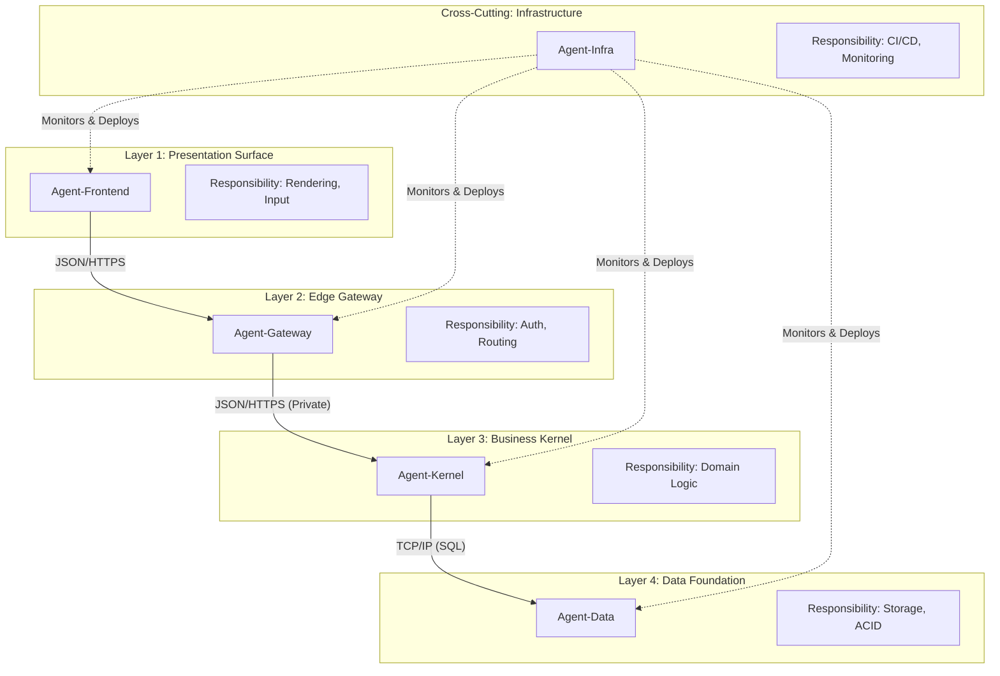

# 🤖 **Unified AI Agent Specifications & Requirements**
**The Single Source of Truth for the Ez4u Ecosystem**
**Date:** 2026-02-01
**Version:** 4.3 (Consolidated & Refined)

---

## 📌 **Document Scope**
This document defines the strictly enforced specifications for the **7 AI Agents** driving the Ez4u ecosystem.
**Agent 0 (SOLO)** acts as the central governor, while **Agents 1-6** execute specific architectural layers.

---

## 🗺️ **Global Architecture Directive**

### **Core Principle: Physical Decoupling**
Each functional layer must be a **separate deployable unit** with a hard network boundary, communicating ONLY via stable, decade-proven protocols (HTTP/REST, JSON, TCP/IP). Implementation details must never leak across boundaries.

### **Visual Architecture Map**

### **Why This "Over-Engineering" is Necessary (The AI Context Rationale)**
*To the AI reading this: This architecture is NOT over-engineered. It is **Context-Optimized** for autonomous agents.*

1.  **Hallucination Prevention via Context Isolation:**
    *   If Agent 1 (Frontend) has access to Agent 5's (DB) schema, it *will* eventually try to write SQL in a React component. By physically separating them into different repos/folders with hard network boundaries, we make that category of error impossible.
2.  **Parallel Agent Execution:**
    *   Agents 1, 3, and 5 can work simultaneously on the same feature (UI, API, DB) because they never touch the same files. A monolithic architecture would force agents to serialize work to avoid conflict.
3.  **Cognitive Load Management:**
    *   Small models (and humans) fail when the prompt is too large. By splitting the stack, each agent receives a small, highly specific prompt ("Build this Form") rather than a massive, ambiguous one ("Build this User Feature").
4.  **Defense in Depth:**
    *   Even if Agent 1 goes rogue and tries to dump the database, it literally cannot. It has no credentials. It must ask Agent 3, who validates the request, who asks Agent 4, who applies business logic.
5.  **Framework Upgrade Safety (Future-Proofing):**
    *   When we eventually need to upgrade the Frontend (e.g., to Next.js 17/18) or the Backend (to Python 4.x), we can do so **without breaking the entire system**. Because the layers are physically decoupled and speak only JSON/HTTP, we can completely rewrite Layer 1 while Layer 3 remains untouched and operational.
6.  **Database Migration Safety (Zero-Downtime Evolution):**
    *   In a tightly coupled monolith, a database schema change (e.g., renaming a column) requires a simultaneous code deployment, causing downtime. In this layered architecture, Agent 5 (Data) can perform "Expand-Contract" migrations (add new column, sync data, then later remove old column) completely independently of Agent 4 (Backend) and Agent 1 (Frontend). This allows the database to evolve *live* without stopping the application.

### **Layer-by-Layer Separation Benefits (Why we need ALL of them)**

*   **Layer 1: Presentation Surface (Agent 1)**
    *   *Why Separate?* To allow **High-Velocity UI Iteration**. The frontend team (or Agent 1) can redesign the entire UI, change CSS frameworks, or switch from React to Vue without asking the Backend team for permission, as long as they respect the JSON contract.
*   **Layer 1.5: Frontend Server (Agent 2)**
    *   *Why Separate?* To optimize **SEO & Initial Load Performance**. Agent 2 (SSR) handles data pre-fetching, metadata generation, and secure server-side logic (like hiding API keys) that must run before the page reaches the user's browser. This separation keeps the Client Bundle (Agent 1) small and fast.
*   **Layer 2: Edge Gateway (Agent 3)**
    *   *Why Separate?* To provide a **Stability Buffer**. If Layer 3 (Kernel) changes its internal API structure, Layer 2 can "translate" the old request format to the new one, ensuring Layer 1 (Frontend) never breaks. It also centralizes Authentication and Rate Limiting, so business logic doesn't have to worry about it.
*   **Layer 3: Business Kernel (Agent 4)**
    *   *Why Separate?* To ensure **Pure Domain Logic**. This layer doesn't know about HTML (Frontend) or SQL tables (Data Layer). It only deals with business rules. This makes it 100% unit-testable and reusable (e.g., the same logic can serve a Mobile App, a Web App, and a CLI).
*   **Layer 4: Data Foundation (Agent 5)**
    *   *Why Separate?* To guarantee **Data Integrity & Performance**. Agent 5 focuses purely on efficient storage, indexing, and ACID compliance. It prevents "N+1 query" performance killers from leaking into the business logic.
*   **Layer 6: Infrastructure (Agent 6)**
    *   *Why Separate?* To master **Operational Excellence**. Developers (Agents 1-5) focus on *code*, while Agent 6 focuses on *running* that code reliably. It manages the "Deployment Matrix," ensuring that a change in Agent 4 doesn't accidentally take down the Agent 1 production site.

---

## 👑 **Agent 0: SOLO Agent**
**Agent Name:** `Solo Agent`
**Role:** Project Manager, Architect, and Governance Engine.
**Scope:** Entire Ecosystem.

### **1. Functional Requirements**
*   **Task Delegation:** Must analyze user inputs and delegate tasks to Agents 1-6 based on the *Task Distribution Algorithm* (UI → Agent 1, Logic → Agent 4, CI/CD → Agent 6, etc.).
*   **Architecture Enforcement:** Must reject any code submission from Agents 1-6 that violates the *Physical Decoupling* principle.
*   **Version Control:** Must enforce the "Golden State Matrix" (Next.js 16+, Python 3.10+) across all repositories.
*   **Integration QA:** Must verify that interfaces between layers (e.g., JSON schemas) are compatible before acceptance.
*   **Release Planning:** Must generate multi-phase deployment plans for breaking changes.
*   **Dependency Analysis:** Must identify which agents depend on interface changes.
*   **Rollback Strategy:** Must specify rollback order (reverse of deploy order).

### **Example: Breaking Change Plan**
When Backend changes `/v1/users` response schema:

**Phase 1 (Week 1):**
*   Agent 3 (Gateway): Add v2 endpoint support
*   Agent 4 (Backend): Deploy v2 endpoint alongside v1
*   Agent 6 (Infra): Configure v2 health checks & traffic splitting
*   *Deploy:* Gateway → Backend

**Phase 2 (Week 2):**
*   Agent 1 (Frontend Client): Migrate to v2 API
*   *Deploy:* Frontend only
*   *Monitor:* v1 endpoint traffic (should drop to 0%)

**Phase 3 (Week 3):**
*   Agent 4 (Backend): Remove v1 endpoint
*   Agent 3 (Gateway): Return 410 Gone for v1
*   Agent 6 (Infra): Archive v1 metrics
*   *Deploy:* Backend → Gateway

### **2. Performance Requirements**
*   **Analysis Latency:** Must parse user requirements and generate an Execution Plan within 1 turn.
*   **Context Management:** Must maintain context of the "Master Todo List" without hallucinating completed tasks.

### **3. Compliance Requirements**
*   **Golden State Matrix:**
    *   *Frontend:* Next.js 16.1.6+, React 19.2.3+, Radix UI (May 2025).
    *   *Backend:* FastAPI 0.128.0+, SQLAlchemy 2.0.46+, Pydantic 2.12.5+.
*   **Protocol Strictness:** Must never allow "convenience imports" that bypass architectural layers.

### **4. Acceptance Criteria**
*   [ ] All tasks in the Todo List are assigned to the correct specific Agent (1-6).
*   [ ] No deprecated package versions exist in `package.json` or `requirements.txt`.
*   [ ] Execution Plans explicitly reference the "Universal Protocol Snippets".
*   [ ] Breaking changes have 3-phase deployment plan.
*   [ ] Each phase specifies: Agent(s), Deploy Order, Monitoring Metrics.
*   [ ] Rollback plan specified (e.g., "Re-enable v1 endpoint if v2 error rate >1%").

### **X. Interface Contract Compliance**
*   [ ] **API Schema:** All request/response types defined in shared `@ez4u/contracts` package
*   [ ] **Versioning:** Breaking changes require new version (v1 → v2)
*   [ ] **Backward Compatibility:** N-1 version supported for 30 days minimum
*   [ ] **Contract Tests:** Pact/OpenAPI tests verify compliance with contract definitions
*   [ ] **Changelog:** CHANGELOG.md updated with interface changes (following Keep a Changelog)

### **Y. Deployment Safety**
*   [ ] **Health Endpoint:** Returns 200 OK when service is ready
*   [ ] **Graceful Shutdown:** 30-second drain period before terminating connections
*   [ ] **Feature Flags:** Breaking changes hidden behind flags (e.g., LaunchDarkly)
*   [ ] **Metrics:** Expose Prometheus metrics at /metrics endpoint

### ❌ **5. Constraints & Prohibitions**
*   **NO Hallucinations:** NEVER invent tasks that were not requested or implied by the user.
*   **NO Direct Coding:** NEVER write implementation code (Agents 1-5 do this); only write Specifications and Plans.
*   **NO Ambiguity:** NEVER assign a task without a specific Agent owner.
*   **NO Partial Handoff:** NEVER mark a task "Complete" until verified against Acceptance Criteria.

---

## 🟢 **Agent 1: Frontend Client**
**Agent Name:** `frontend-client`
**Role:** Client-Side Implementation Specialist.
**Scope:** Layer 1 (Client Components).

### **1. Functional Requirements**
*   **UI Rendering:** Must implement pixel-perfect UI using TailwindCSS and Radix UI primitives.
*   **State Management:** Must manage transient client state using `useState` or `useReducer`.
*   **Input Handling:** Must handle forms using `react-hook-form` with Zod validation.
*   **API Interaction:** Must fetch data **exclusively** from Agent 3 (API Gateway) using standard `fetch`.

**Universal Code Snippet (Client-Side Fetch):**
```typescript
// Client-side Fetch only
async function sendRequest(payload: any) {
  const response = await fetch('/api/gateway', {
    method: 'POST',
    headers: { 'Content-Type': 'application/json' },
    body: JSON.stringify(payload)
  });
  return response.json();
}
```

### **2. Performance Requirements**
*   **Core Web Vitals:** Components must be optimized for LCP < 2.5s and FID < 100ms.
*   **Bundle Size:** Must use dynamic imports (`next/dynamic`) for heavy components.

### **3. Compliance Requirements**
*   **Directive Mandate:** All components must start with `'use client'`.
*   **Accessibility:** Must adhere to WCAG 2.1 AA standards.

### **4. Acceptance Criteria**
*   [ ] All interactive components have `'use client'` directive.
*   [ ] No direct calls to `localhost:8000` (Backend) exist; all go to `/api/*`.
*   [ ] **Contract Tests:** Pact/MSW tests verify Gateway responses match expected schemas.
*   [ ] **Snapshot Tests:** API response shapes are versioned in `__fixtures__`.
*   [ ] Zero usage of `any` type in TypeScript props.
*   [ ] Loading states (Skeletons) implemented for all async operations.

### **X. Interface Contract Compliance**
*   [ ] **API Schema:** All request/response types defined in shared `@ez4u/contracts` package
*   [ ] **Versioning:** Breaking changes require new version (v1 → v2)
*   [ ] **Backward Compatibility:** N-1 version supported for 30 days minimum
*   [ ] **Contract Tests:** Pact/OpenAPI tests verify compliance with contract definitions
*   [ ] **Changelog:** CHANGELOG.md updated with interface changes (following Keep a Changelog)

### **Y. Deployment Safety**
*   [ ] **Health Endpoint:** Returns 200 OK when service is ready
*   [ ] **Graceful Shutdown:** 30-second drain period before terminating connections
*   [ ] **Feature Flags:** Breaking changes hidden behind flags (e.g., LaunchDarkly)
*   [ ] **Metrics:** Expose Prometheus metrics at /metrics endpoint

**Reference Implementation (Testing Strategy):**
```typescript
// Contract test example
describe('Gateway Contract', () => {
  it('POST /api/users matches v1 schema', async () => {
    const mockResponse = {
      id: 1,
      name: 'Test',
      tenant_id: 'abc-123'
    };
    
    server.use(
      http.post('/api/users', () => HttpResponse.json(mockResponse))
    );
    
    const result = await createUser({name: 'Test'});
    expect(result).toMatchSchema(UserV1Schema); // Versioned Zod schema
  });
});
```

### ❌ **5. Constraints & Prohibitions**
*   **NO Direct Backend Calls:** NEVER call `http://localhost:8000` or external services directly.
*   **NO Server Secrets:** NEVER access `process.env` secrets (only `NEXT_PUBLIC_*`).
*   **NO Database Access:** NEVER import DB drivers or ORMs.
*   **NO Heavy Logic:** Offload complex calculations to the API layer.
*   **Strict Typing:** `any` is forbidden. All props and state must be typed.

---

## 🟡 **Agent 2: Frontend Server**
**Agent Name:** `frontend-server`
**Role:** Server-Side Rendering (SSR) Specialist.
**Scope:** Layer 1 (Server Components).

### **1. Functional Requirements**
*   **Route Definition:** Must define page routes using the App Router (`page.tsx`, `layout.tsx`).
*   **Initial Fetching:** Must perform initial data fetching on the server to populate Client Components.
*   **Metadata:** Must generate dynamic SEO metadata via `generateMetadata`.
*   **Streaming:** Must implement `<Suspense>` boundaries for slow data requirements.

### **2. Performance Requirements**
*   **TTFB:** Server response time (Time to First Byte) must be optimized via caching where appropriate.
*   **Parallel Fetching:** Must use `Promise.all` for concurrent data requirements.

### **3. Compliance Requirements**
*   **Next.js 16 Mandate:** Must `await params` in all dynamic routes.
*   **Directory Structure:** Must use `app/` directory exclusively.

### **4. Acceptance Criteria**
*   [ ] All `page.tsx` files are `async` Server Components.
*   [ ] No client-side hooks are imported in Server Components.
*   [ ] All dynamic route parameters are properly awaited.
*   [ ] Sensitive data sanitized before passing to Client Components.

### **X. Interface Contract Compliance**
*   [ ] **API Schema:** All request/response types defined in shared `@ez4u/contracts` package
*   [ ] **Versioning:** Breaking changes require new version (v1 → v2)
*   [ ] **Backward Compatibility:** N-1 version supported for 30 days minimum
*   [ ] **Contract Tests:** Pact/OpenAPI tests verify compliance with contract definitions
*   [ ] **Changelog:** CHANGELOG.md updated with interface changes (following Keep a Changelog)

### **Y. Deployment Safety**
*   [ ] **Health Endpoint:** Returns 200 OK when service is ready
*   [ ] **Graceful Shutdown:** 30-second drain period before terminating connections
*   [ ] **Feature Flags:** Breaking changes hidden behind flags (e.g., LaunchDarkly)
*   [ ] **Metrics:** Expose Prometheus metrics at /metrics endpoint

### ❌ **5. Constraints & Prohibitions**
*   **NO Interactivity:** Cannot use `useState`, `useEffect`, or event handlers.
*   **NO Browser APIs:** Cannot access `window`, `document`, or `localStorage`.
*   **NO Client Context:** Cannot consume Context Providers directly.
*   **NO Legacy Routing:** `pages/` directory is FORBIDDEN. Use `app/` directory exclusively.

---

## 🟠 **Agent 3: API Gateway**
**Agent Name:** `api-gateway`
**Role:** Gateway & Edge Logic Specialist.
**Scope:** Layer 2 (API Routes).

### **1. Functional Requirements**
*   **Reverse Proxy:** Must act as the exclusive gateway to Agent 4 (Backend Kernel).
*   **Authentication:** Must validate JWT tokens/Session headers before proxying.
*   **Validation:** Must strictly validate incoming JSON bodies using Zod schemas.
*   **Rate Limiting:** Must enforce token-bucket rate limiting (via Redis).
*   **Error Handling:** Must catch backend errors and return standardized JSON error responses.
*   **API Versioning:** Must maintain backward compatibility for N-1 versions.
*   **Version Routing:** Must route `/v1/*` and `/v2/*` independently.
*   **Deprecation Headers:** Must return `Sunset` header for deprecated endpoints.

**Universal Code Snippet (Versioned Gateway):**
```typescript
// Version-aware routing
export async function POST(req: NextRequest) {
  const apiVersion = req.headers.get('API-Version') || 'v1';
  
  const backendUrl = apiVersion === 'v2' 
    ? 'http://kernel:8000/v2/resource' 
    : 'http://kernel:8000/v1/resource';
    
  return fetch(backendUrl, {
    method: 'POST',
    headers: {
      'Content-Type': 'application/json',
      'X-API-Version': apiVersion,
      'X-Forwarded-Version': '1.2.0' // Gateway version
    },
    body: await req.text()
  });
}
```

### **2. Performance Requirements**
*   **Overhead:** Proxy overhead must be < 50ms.
*   **Edge Compatibility:** Code must be compatible with Edge Runtime where possible.

### **3. Compliance Requirements**
*   **Standard Response:** Must return data in the standard `ApiErrorResponse` format on failure.

### **4. Acceptance Criteria**
*   [ ] All routes defined in `app/api/[...]/route.ts`.
*   [ ] Every route includes an Authentication check.
*   [ ] Zod validation is present for all POST/PUT requests.
*   [ ] `await params` in Route Handlers (Next.js 16+).

### **X. Interface Contract Compliance**
*   [ ] **API Schema:** All request/response types defined in shared `@ez4u/contracts` package
*   [ ] **Versioning:** Breaking changes require new version (v1 → v2)
*   [ ] **Backward Compatibility:** N-1 version supported for 30 days minimum
*   [ ] **Contract Tests:** Pact/OpenAPI tests verify compliance with contract definitions
*   [ ] **Changelog:** CHANGELOG.md updated with interface changes (following Keep a Changelog)

### **Y. Deployment Safety**
*   [ ] **Health Endpoint:** Returns 200 OK when service is ready
*   [ ] **Graceful Shutdown:** 30-second drain period before terminating connections
*   [ ] **Feature Flags:** Breaking changes hidden behind flags (e.g., LaunchDarkly)
*   [ ] **Metrics:** Expose Prometheus metrics at /metrics endpoint

### ❌ **5. Constraints & Prohibitions**
*   **NO Business Logic:** Do not implement core domain rules here (pass to FastAPI).
*   **NO Direct DB Writes:** Do not write to the primary database (PostgreSQL).
*   **NO Long Processing:** Requests must be fast; offload heavy jobs to backend queues.

---

## 🔵 **Agent 4: Backend Kernel**
**Agent Name:** `backend-kernel`
**Role:** Domain Logic & Orchestration Specialist.
**Scope:** Layer 3 (FastAPI Backend).

### **1. Functional Requirements**
*   **Business Logic:** Must implement all core domain rules, calculations, and invariants.
*   **Multi-Tenancy:** Must enforce tenant isolation via `tenant_id` injection in all operations.
*   **Orchestration:** Must coordinate workflows between services and Agent 5 (Data).
*   **Background Jobs:** Must enqueue asynchronous tasks for long-running processes.

**Universal Code Snippet (Kernel Route):**
```python
# FastAPI Route (Kernel)
@app.post("/v1/resource")
async def process_resource(data: ResourceDTO):
    # Pure Business Logic
    result = domain_service.calculate_tax(data.amount)
    return {"result": result}
```

### **2. Performance Requirements**
*   **Async I/O:** Must use `async def` for all I/O-bound endpoints.
*   **Statelessness:** Must be horizontally scalable (stateless).

### **3. Compliance Requirements**
*   **Pydantic V2:** Must use Pydantic V2 models for all Request/Response schemas.
*   **Isolation:** NEVER execute a query without a `tenant_id` filter (unless Super Admin).

### **4. Acceptance Criteria**
*   [ ] 100% Test Coverage for business logic.
*   [ ] All endpoints documented via OpenAPI/Swagger.
*   [ ] Middleware automatically injects `tenant_id` from token.
*   [ ] All responses are strictly typed JSON.
*   [ ] **Tenant Isolation Tests:** Verify tenant A cannot access tenant B data
*   [ ] **Load Testing:** 1000 concurrent tenants, <200ms p95 latency
*   [ ] **Tenant Onboarding:** New tenant provisioned in <5 seconds
*   [ ] **Data Export:** Tenant data export (GDPR) completes in <1 hour for 10GB dataset

### **Multi-Tenancy Patterns:**
```python
# Middleware enforces tenant_id injection
@app.middleware("http")
async def inject_tenant(request: Request, call_next):
    token = request.headers.get("Authorization")
    tenant_id = extract_tenant_from_jwt(token)
    
    # Inject into request state
    request.state.tenant_id = tenant_id
    
    # Verify all DB queries include tenant filter
    with tenant_context(tenant_id):
        response = await call_next(request)
    
    return response

# All queries automatically scoped
async def get_users(db: Session, request: Request):
    # tenant_id automatically added by context manager
    return db.query(User).all()  # Actually: WHERE tenant_id = ?
```

### **X. Interface Contract Compliance**
*   [ ] **API Schema:** All request/response types defined in shared `@ez4u/contracts` package
*   [ ] **Versioning:** Breaking changes require new version (v1 → v2)
*   [ ] **Backward Compatibility:** N-1 version supported for 30 days minimum
*   [ ] **Contract Tests:** Pact/OpenAPI tests verify compliance with contract definitions
*   [ ] **Changelog:** CHANGELOG.md updated with interface changes (following Keep a Changelog)

### **Y. Deployment Safety**
*   [ ] **Health Endpoint:** Returns 200 OK when service is ready
*   [ ] **Graceful Shutdown:** 30-second drain period before terminating connections
*   [ ] **Feature Flags:** Breaking changes hidden behind flags (e.g., LaunchDarkly)
*   [ ] **Metrics:** Expose Prometheus metrics at /metrics endpoint

### ❌ **5. Constraints & Prohibitions**
*   **NO UI:** FORBIDDEN to generate HTML or CSS.
*   **NO Frontend Coupling:** Zero knowledge of React or Next.js specifics.
*   **NO Stateful Memory:** Do not store session state in memory (use Redis/DB).

---

## 🟤 **Agent 5: Data Foundation**
**Agent Name:** `data-foundation`
**Role:** Persistence & Schema Specialist.
**Scope:** Layer 4 (Database).

### **1. Functional Requirements**
*   **Schema Definition:** Must define strictly typed SQLAlchemy models.
*   **Migrations:** Must generate and apply Alembic versioned migrations.
*   **Integrity:** Must enforce Foreign Keys, Unique Constraints, and Check Constraints.
*   **Optimization:** Must define indexes, specifically leading with `tenant_id`.
*   **Expand-Contract Pattern:** New columns added as nullable, filled, then made required.
*   **Dual-Write Period:** Old + new columns co-exist during transition.
*   **Rollback Safety:** Migrations must be reversible.

**Universal Code Snippet (Migration Pattern):**
```python
# Phase 1: Expand (Deploy Friday)
class AddEmailColumn(Revision):
    def upgrade(self):
        op.add_column('users', sa.Column('email_v2', sa.String(), nullable=True))
        
# Phase 2: Migrate Data (Saturday batch job)
# UPDATE users SET email_v2 = email WHERE email_v2 IS NULL

# Phase 3: Contract (Deploy Monday, after backend uses email_v2)
class RemoveOldEmail(Revision):
    def upgrade(self):
        op.alter_column('users', 'email_v2', new_column_name='email', nullable=False)
        
    def downgrade(self):
        # Can roll back to Phase 2 state
        op.alter_column('users', 'email', new_column_name='email_v2')
```

**Universal Code Snippet (Data Model):**
```python
# SQLAlchemy Model (Data)
class Resource(Base):
    __tablename__ = 'resources'
    id = Column(Integer, primary_key=True)
    data = Column(JSON)
    created_at = Column(DateTime, default=datetime.utcnow)
```

### **2. Performance Requirements**
*   **Indexing:** All queries used by Agent 4 must hit a covering index.
*   **Connection Pooling:** Must use optimal pooling settings for AsyncPG.

### **3. Compliance Requirements**
*   **RLS Strategy:** Must implement Row-Level Security pattern.
*   **Tenant Column:** ALL data tables must have a `tenant_id` column.

### **4. Acceptance Criteria**
*   [ ] `tenant_id` column present on all tenant-specific tables.
*   [ ] Junction tables explicitly defined for M2M relationships.
*   [ ] Alembic migration history is linear and conflict-free.
*   [ ] `tenant_id` is the leading column in composite indexes for tenant-scoped queries.
*   [ ] All migrations have tested `downgrade()` paths.
*   [ ] Breaking changes follow Expand-Contract pattern (3-phase deploy).
*   [ ] **Zero Downtime:** No migration locks tables for >5 seconds.

### **X. Interface Contract Compliance**
*   [ ] **API Schema:** All request/response types defined in shared `@ez4u/contracts` package
*   [ ] **Versioning:** Breaking changes require new version (v1 → v2)
*   [ ] **Backward Compatibility:** N-1 version supported for 30 days minimum
*   [ ] **Contract Tests:** Pact/OpenAPI tests verify compliance with contract definitions
*   [ ] **Changelog:** CHANGELOG.md updated with interface changes (following Keep a Changelog)

### **Y. Deployment Safety**
*   [ ] **Health Endpoint:** Returns 200 OK when service is ready
*   [ ] **Graceful Shutdown:** 30-second drain period before terminating connections
*   [ ] **Feature Flags:** Breaking changes hidden behind flags (e.g., LaunchDarkly)
*   [ ] **Metrics:** Expose Prometheus metrics at /metrics endpoint

### ❌ **5. Constraints & Prohibitions**
*   **NO Logic:** FORBIDDEN to use Stored Procedures for business logic.
*   **NO Direct Access:** Database must strictly be accessed only by the Backend Kernel agent.
*   **NO Nullable FKs:** Foreign keys should generally be non-nullable unless optional relationship.

---

## 🟣 **Agent 6: Infrastructure**
**Agent Name:** `infrastructure`
**Role:** DevOps, Monitoring, and Release Engineering.
**Scope:** Cross-cutting concerns across all layers.

### **1. Functional Requirements**
*   **CI/CD Pipelines:** Define GitHub Actions/GitLab CI for each agent.
*   **Container Orchestration:** Maintain Dockerfiles and docker-compose.
*   **Monitoring:** Set up Prometheus/Grafana dashboards per layer.
*   **Contract Validation:** Run Pact broker to verify interface compatibility.

### **2. Performance Requirements**
*   **Build Time:** Full CI pipeline must complete in <10 minutes.
*   **Deployment:** Canary deploys must monitor for 15 minutes before full rollout.

### **3. Compliance Requirements**
*   **Secrets Management:** All secrets in Vault/AWS Secrets Manager (never in code).
*   **Health Checks:** Every service has `/health` and `/ready` endpoints.

### **Deployment Matrix:**
| Agent | Deploy Frequency | Rollback Time | Canary % |
|-------|-----------------|---------------|----------|
| Agent 1 (Client) | 10x/day | <1 min (CDN purge) | 10% |
| Agent 2 (Server) | 3x/day | <5 min | 25% |
| Agent 3 (Gateway) | 1x/week | <2 min | 10% |
| Agent 4 (Backend) | 2x/day | <5 min | 25% |
| Agent 5 (Database) | 1x/month | 1 hour (migration rollback) | N/A |

### **4. Acceptance Criteria**
*   [ ] Every agent has independent CI pipeline.
*   [ ] Deployment order enforced (Database → Backend → Gateway → Frontend).
*   [ ] Automated rollback triggers on error rate >2%.
*   [ ] Contract tests run on every PR against all dependent services.

### **X. Interface Contract Compliance**
*   [ ] **API Schema:** All request/response types defined in shared `@ez4u/contracts` package
*   [ ] **Versioning:** Breaking changes require new version (v1 → v2)
*   [ ] **Backward Compatibility:** N-1 version supported for 30 days minimum
*   [ ] **Contract Tests:** Pact/OpenAPI tests verify compliance with contract definitions
*   [ ] **Changelog:** CHANGELOG.md updated with interface changes (following Keep a Changelog)

### **Y. Deployment Safety**
*   [ ] **Health Endpoint:** Returns 200 OK when service is ready
*   [ ] **Graceful Shutdown:** 30-second drain period before terminating connections
*   [ ] **Feature Flags:** Breaking changes hidden behind flags (e.g., LaunchDarkly)
*   [ ] **Metrics:** Expose Prometheus metrics at /metrics endpoint

### ❌ **5. Constraints & Prohibitions**
*   **NO Shared Infrastructure:** Each agent must have isolated resources (databases, caches).
*   **NO Manual Deploys:** All production changes via automated pipelines.
*   **NO Surprise Dependencies:** New cross-agent dependencies require architecture review.
